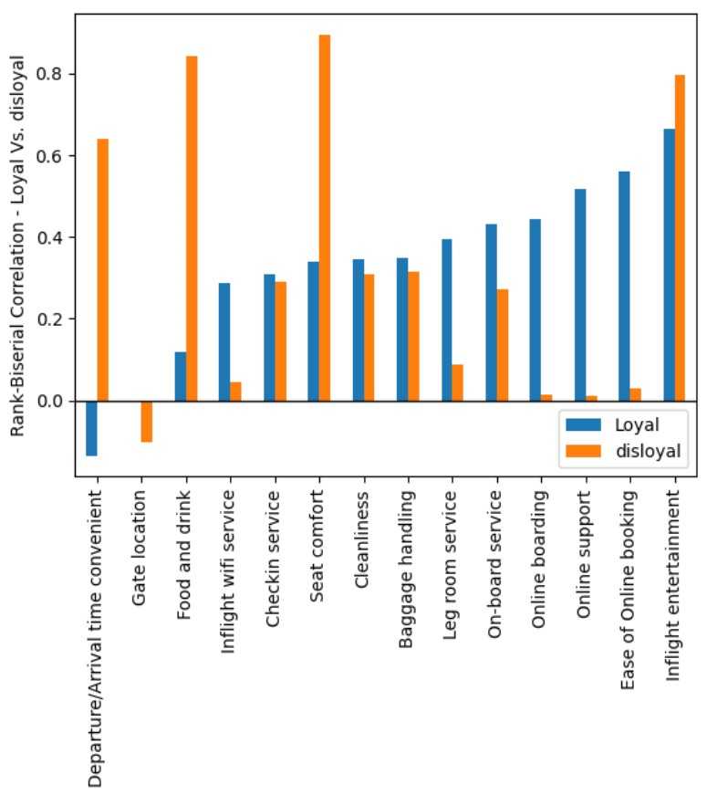

# Airline Passenger Satisfaction Analysis
## Project Summary

This project analyzes airline passenger satisfaction using a real-world dataset (from 2018). 
The goal was to identify key factors influencing customer satisfaction, such as service quality, customers' loyalty, travel class and other customer attributes.

The analysis included data cleaning, exploratory data analysis, correlation analysis, and comperative analysis between satisfied and dissatisfied customers.

Main results show that for different groups of customers (e.g. by travel class or loyalty), different service-related variables are associated with overall customer satisfaction. 

The project combines statistical analysis with practical interpretation to support decision-making from a customer experience perspective.

## Dataset

Kaggle dataset link:
https://www.kaggle.com/datasets/johndddddd/customer-satisfaction

## Notebook

- [View the full notebook on GitHub](passenger-satisfaction-project.ipynb)
- [View the notebook on Kaggle](https://www.kaggle.com/code/noamaurer/passenger-satisfaction-project)

## Key Insight Visualization

## Learning Experience

The DataCamp course provided a solid foundation in Python and pandas, which I used throughout this project. Although the project required extending beyond the guided exercises, the core concepts — such as data manipulation, grouping, and visualization — were directly applicable and helped structure the analysis process.

Working on this project allowed me to build on these fundamentals and apply them in a more realistic and open-ended context.
